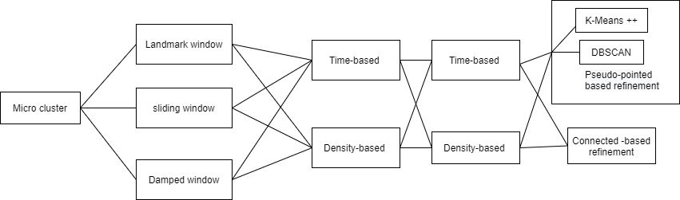

# Sesame 

# Time Table

1. code refactor - 8/Nov/2021
2. modularized algorithm design + workflow diagram - 10/Nov/2021
3. experimental test - 17/Nov/2021
4. first complete draft - 24/Nov/2021
5. first submission - 1/Dec/2021

Add-on. Learn how to draw figure using python -- Zhonghao.

# Evaluation Results

Tree structure algorithms : EDMStream; BIRCH; 

All MC combinations listed below:

| Done | Data Structure | Window model | outlier detection | concept Drift Handling | Offline Refinement | Purity | CMM  | Time |
| ---- | -------------- | ------------ | ----------------- | ---------------------- | ------------------ | ------ | ---- | ---- |
|      | MC             | Landmark     | Density           | Time                   | KMeans++           |        |      |      |
|      | MC             | Landmark     | Time              | Time                   | KMeans++           |        |      |      |
|      | MC             | Landmark     | Density           | Time                   | Connection         |        |      |      |
|      | MC             | Landmark     | Time              | Time                   | Connection         |        |      |      |
|      | MC             | Landmark     | Density           | Density                | KMeans++           |        |      |      |
|      | MC             | Landmark     | Time              | Density                | KMeans++           |        |      |      |
|      | MC             | Landmark     | Density           | Density                | Connection         |        |      |      |
|      | MC             | Landmark     | Time              | Density                | Connection         |        |      |      |
|      |                |              |                   |                        |                    |        |      |      |
|      | MC             | Damped       | Density           | Time                   | KMeans++           |        |      |      |
|      | MC             | Damped       | Time              | Time                   | KMeans++           |        |      |      |
|      | MC             | Damped       | Density           | Time                   | Connection         |        |      |      |
|      | MC             | Damped       | Time              | Time                   | Connection         |        |      |      |
|      | MC             | Damped       | Density           | Density                | KMeans++           |        |      |      |
|      | MC             | Damped       | Time              | Density                | KMeans++           |        |      |      |
|      | MC             | Damped       | Density           | Density                | Connection         |        |      |      |
|      | MC             | Damped       | Time              | Density                | Connection         |        |      |      |
|      |                |              |                   |                        |                    |        |      |      |
|      | MC             | Sliding      | Density           | Time                   | KMeans++           |        |      |      |
|      | MC             | Sliding      | Time              | Time                   | KMeans++           |        |      |      |
|      | MC             | Sliding      | Density           | Time                   | Connection         |        |      |      |
|      | MC             | Sliding      | Time              | Time                   | Connection         |        |      |      |
|      | MC             | Sliding      | Density           | Density                | KMeans++           |        |      |      |
|      | MC             | Sliding      | Time              | Density                | KMeans++           |        |      |      |
|      | MC             | Sliding      | Density           | Density                | Connection         |        |      |      |
|      | MC             | Sliding      | Time              | Density                | Connection         |        |      |      |

# Flow chart
